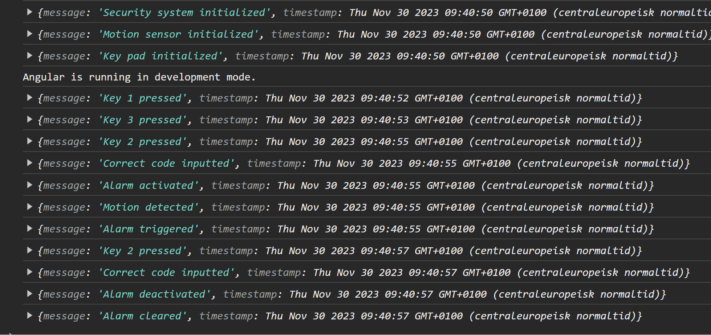

# Home Security System Lab

I den här labben ska vi skapa en Angular-app som hjälper till att hantera ett säkerhetssystem för hemmet. Vi börjar med att sätta upp projektet med Angular CLI för att sedan använda de koncept som ni precis fått ta till er. 

Ni får gärna stanna kvar i detta rum men om ni hellre vill sitta vid era välbekanta skrivbord så går det också bra. 

## Tidsåtgång
Beräknad tidsåtgång är ca 60 minuter, men vi har fram till kl 16 på oss.

## Standalone
Notera att labben använder standalone komponenter, vilket nu är standard vid nya Angularprojekt. Således finns ingen modul för importer utan varje komponent måste importera sina lokala beroenden.

## Labbens innehåll
1. [Skapa ett nytt Angular-projekt](#steg-1-skapa-ett-nytt-angular-projekt)
2. [Sätt komponentstrukturen](#sätt-komponentstrukturen)
    1. [Detektera rörelse](#steg-1-detektera-rörelse)
    2. [Larmkomponent](#steg-2-larmkomponent)
3. [Dela state - Property binding och Event emitter](#dela-state---property-binding-och-event-emitter)
   1. [@Output och Event Emitter](#steg-1-output-och-event-emitter)
   2. [Property binding via @Input](#steg-2-property-binding-via-input)
   3. [Signalera rätt inmatad kod](#steg-3-signalera-rätt-inmatad-kod)
4. [Trigga larmet](#trigga-larmet)
5. [Händelseström](#händelseström)
   1. [Skapa en service](#steg-1-skapa-en-event-service)
   2. [Nyttja DI i komponenterna](#steg-2-nyttja-di-i-komponenterna)
   3. [Skriv ut alla händelser](#steg-3-skriv-ut-alla-händelser)
   4. [Prenumera på events (RxJS)](#steg-4-prenumerera-på-events)
   5. [Pipes](#steg-5-pipes)

## Angular CLI

### Steg 1: Skapa ett nytt Angular-projekt
Öppna en terminal och ställ dig i den root-katalog du önskar skapa projektet i. Projektet kommer hamna i sin egna katalog.

I terminalen, kör sedan följande kommando för att skapa ett nytt Angular-projekt:

```bash
ng new home-security-system
```
Följ anvisningarna för att konfigurera ditt projekt. Välj stilmallsformat efter önskemål och Nej på SSR.

### Steg 2: Navigera till Projektmappen

```bash
cd home-security-system
```

### Steg 3: Skapa Komponenter
Börja med att skapa en komponent för vår rörelsesensor

```bash
ng generate component motion-sensor
```

### Steg 4: Uppdatera Appkomponenten
Öppna src/app/app.component.html och ersätt innehållet med följande:

```html
<div>
  <app-motion-sensor></app-motion-sensor>
</div>
```
> **OBS:**  Du får ett fel i att komponenten inte är ett känt element. Du måste importera komponenten i app.component.ts och sen skicka in den i listan av template dependencies (imports).

```javascript
import { MotionSensorComponent } from './motion-sensor/motion-sensor.component';

...

imports: [..., MotionSensorComponent]
```

### Steg 5: Starta appen
```bash
ng serve --open
```

Webbläsaren bör öppnas, om inte så navigera till http://localhost:4200/. Du bör se texten "motion-sensor works!"

Bra jobbat! Du har skapat grunden för vår Angular-app. Nästa steg är att bygga ut funktionerna.

### Kodvalidering
[Koden bör se ut så här](#angular-cli-validering)

## Sätt komponentstrukturen
Dags att bygga vidare på motion-sensor samt lägga till fler komponenter som applikationen behöver. Vi kommer titta på hur vi kan dela information mellan komponenterna så att de kan bilda en helhet.

### Steg 1: Detektera rörelse
Komponenten motion-sensor har just nu inget state. Låt oss lägga till det samt två metoder som sätter detta state. 

```typescript
export class MotionSensorComponent {
  motionDetected: boolean = false;

  setMotionDetected(): void {
    this.motionDetected = true;
  }

  clearMotion(): void {
    this.motionDetected = false;
  }
}
```

Skapa sedan två knappar (```Motion detected``` samt ```Motion cleared```) i html-filen som binder ```(click)``` till respektive metod här ovanför. Direkt efter dessa knappar kan du skriva ut aktuell status på rörelsesensorn med en template expression ```{{ expression }}```. *Försök gärna själv, om du kör fast finns en kodvalidering [här](#kompontnestruktur-1-validering)*

### Steg 2: Larmkomponent
Vi vill kunna larma av och på vårat hus. Skapa en security-keypad komponent via ```Angular CLI``` och lägg till komponenten efter motion sensor i ```app.component.html```. Tänk på att detta blir en ```template dependency``` vilket måste importeras i ```app.component.ts```. **security-keypad works!** bör synas i browsern.

#### Larma av och på
På samma sätt som för rörelsesensorn, skapa ett state för larm av och på, samt metoder för att slå på och av larmet. Detta görs alltså i klassen ```SecurityKeypadComponent```. Namngivningsförslag på state är ```active```.

I templaten för security-keypad, skapa knappar som anropar metoderna för att larma av och på. Skriv ut en text för larmets nuvarande status, precis som för rörelsesensorn.

#### Kodvalidering
[Koden bör se ut så här](#kompontnestruktur-1-validering)

### Steg 3: Förberedelser för att trigga larmet på rörelse när larmet är på
Nu har vi två komponenter med varsitt state. Vi behöver nu en till komponent som symboliserar larmsystemet. Larmssystemet skall triggas om det är aktiverat och rörelse detekteras. 

Skapa en komponent ```security-system```, via CLI, som kommer bli systemets nav/orkestrator. Lägg till komponenten i ```app.component.html```. Tänk på template dependencies.

#### Låt security-system vara förälder till övriga komponenter
Att lägga alla komponenter platt efter varandra i app.component.html är inte hållbart. Vår nyaste komponent, ```security-system``` kommer få två "child components".

Flytta in ```security-keypad``` samt ```motion-sensor``` in i ```security-system```. Flytta template samt imports från app.component till security-system.

### Kodvalidering
[Koden bör se ut så här](#komponentstruktur-2-validering)

## Dela state - Property binding och Event emitter
Nu ska komponenterna interagera med varandra. Vi kommer gå igenom property bindings ```[property]="value"``` och event emitters ```(event)="handler"``` för att trycka ner state i child components samt propagera state upp till parent igen.

### Steg 1: @Output och Event Emitter

Vår rörelsesensor måste berätta för omvärdlen när en stateförändring sker med avseende på rörelse.

Importera Output samt EventEmitter från ```@angular/core``` och definiera en Output längst ned i ```MotionSensorComponent``` classen

```typescript
@Output() motionEvent = new EventEmitter<boolean>();
```

Nu kan vi använda ```motionEvent``` för att meddela omvärlden om att något har hänt. Utöka set och clear metoderna med ```this.motionEvent.emit(true/false)``` i respektive metod.

```typescript
  setMotionDetected(): void {
    this.motionDetected = true;
    this.motionEvent.emit(true);
  }

  clearMotion(): void {
    this.motionDetected = false;
    this.motionEvent.emit(false);
  }
```

Templaten för parent component, dvs ```security-system.component.html``` måste använda event binding mot motionEvent för att reagera på eventet.

```html
{{ motionDetected ? '[Parent] Motion Detected' : '[Parent]  No Motion Detected' }}

<app-motion-sensor (motionEvent)="onMotion($event)"></app-motion-sensor>
```

```$event``` är ett objekt som finns, och som i detta fall blir typat till ```boolean```, eftersom ```motionEvent``` är av typen ```EventEmitter<boolean>```.

Utöka klassen ```SecuritySystemComponent``` med följande eventhanterare och property.

```typescript
  motionDetected: boolean = false;

  onMotion(motionDetected: boolean): void {
    this.motionDetected = motionDetected;
  }
```

Nu har du implementerat event emitter med @Output binding (propagera upp data). Resultatet är att du nu kan tracka rörelser även från föräldern (security-system).

### Steg 2: Property binding via @Input
Systemet behöver ha en kod för att larma på och av. De blir ```security-system``` som ansvarar för koden och vad som händer när rätt kod matas in. 

Låt oss definera en code-property av typen ```string``` i ```security-system.component.ts```. Låt propertyn får defaultvärdet **2**.

Vår keypad måste veta om koden, så att den senare kan signalera om rätt kod är inmatad eller ej. Du ska nu använda ```property binding``` för att binda ```code``` till motsvarande property i vår keypad. Lägg till ```[code]="code"``` i ```security-system.component.ts```.

```html
<app-security-keypad [code]="code" ></app-security-keypad>
```

Notera att code (```[code]```) inte än finns definierad i vår keypad. Definiera egenskapen i SecurityKeypadComponent. Importera ```@Input``` från ```@angular/core```. 

> **Notis:**  @Input dekorerar egenskapen som input-property, dvs att egenskapen kan skickas ner från sin förälder.

```typescript
@Input() code?: string;
```
Nu kan vi skicka ner koden (default **2**) från vårt säkerhetssystem till vår keypad. Verifiera gärna genom att skriva ut koden i webbläsaren från keypadens template med ett ```template expression```.

### Steg 3: Signalera rätt inmatad kod
Dags att använda ```@Output``` och ```EventEmitter``` igen. Men först definiera vår template som representerar en keypad med tre (3) knappar.

```html
<div>
    <div class="key-pad">
    <button (click)="keyPress('1')">1</button>
    <button (click)="keyPress('2')">2</button>
    <button (click)="keyPress('3')">3</button>
    </div>
</div>
```

Notera eventhanteraren ```keyPress(key: string)```. Implementera eventhanteraren i ```SecurityKeypadComponent```. Om *koden är lika med key* skall ett event emittas. Kalla eventet ```correctCodeInput``` och skall vara av typen void. Detta eftersom correctCodeInput endast emittas i fallet att rätt kod inmatas, således behövs ingen extra information. 

Bind eventet mot keypad-elementet i templaten för security-system. Sätt även upp eventhanteraren i ```SecuritySystemComponent```, och toggla en "alarmActive" property. 

Nu ska vi kunna skicka ner en kod (2) via en property binding samt kunna ta emot signal om rätt kod matats in i vår keypad. När rätt kod matats in så larmar vi på eller av beroende på nuvarande state.

### Steg 4 - Städa
Vår key pad signalerar nu när rätt kod matas in till sin förälder och är således inte längre ansvarig för att hålla i larmets state. Dags att rensa bort propertyn ```active``` och överallt där den används (metoder, template).

### Kodvalidering
[Koden bör se ut så här](#dela-state-validering)

## Trigga larmet 
Nu har vi, via ```property binding``` skickat ner vår kod till key pad samt få signal, via ```event binding```, från key pad när rätt kod är inmatad. Samtidigt får vi signal från vår motion sensor, via ```event binding```, när den detekterar en förändring i rörelse. Nu ska vi trigga larmet när larmet är aktivt och rörelsesensorn detekterara rörelse.

### Steg 1: Lägg till state för alarm triggered

Lägg till en boolean egenskap, ```alarmTriggered```, i ```SecuritySystemComponent``` som representerar om larmet har gått av eller ej. Använd ```onMotion``` och ```onCodeMatch``` för att tilldela denna egenskap sitt värde baserat på den information som dessa callbacks förmedlar. 

### Steg 2: Visualisera att larmet gått av
Skapa en komponent ```alarm-state``` som ansvarar för visualiseringen av ett larm som gått av. I detta fall en pulserande röd cirkel. 

I komponentens template, klistra in följande

```html
<div class="pulsating-circle"></div>
```

För att det ska se fint ut, klistra in [css](#trigga-larmet-validering) i komponentens css-fil.

I systemets orkestrator, ```security-system.component```, lägg till den nya komponenten (*tänk på template dependencies*).

Nu bör du se en röd pulserande cirkel i browsern.

### Steg 3: Villkorsstyr visning med NgIf
Alarm-state ska endast synas när larmet faktiskt gått av, dvs när ```alarmTriggered === true```. Lägg på direktivet ```*ngIf``` med villkoret ```alarmTriggered``` 

> **OBS:**  ngIf måste prefixas med*

### Kodvalidering
Nu bör koden se ut [så här](#trigga-larmet-validering)

## Händelseström
Det kan hända en del saker i systemet, och det är dags att visualisera alla händelser som sker. Nu ska vi kika på en del koncept så som t.ex. Dependency Injection (DI), Services, Pipes och RxJS.

Tanken är att du ska skapa en ```service``` med en metod för att registrera en händelse (t.ex. rörelse detekterad) samt ett state i form av en ```Observable<Event>```. Resultatet är att när något sker i systemet ska det direkt bli synligt i browsern.

### Steg 1: Skapa en event service
```bash
ng generate service event
```

Notera att endast två filer skapades; .ts samt .spec.ts. Services har alltså inget med UI att göra. I detta fall kommer denna service hålla ett ```globalt state```.

Notera ```@Injectable``` i ts-filen som aktiverar möjligheten att ange ```EventService``` i en komponents (eller annan service) *konstruktor*, dvs nyttja *Angulars DI-ramverk*.  ```ProvidedIn: 'root'``` medför att samma instans återanvänds på alla ställen som begär ```EventService```, dvs det finns bara **en** instans. En så kallad ```Singleton```. 

```typescript
@Injectable({
  providedIn: 'root'
})
```

Skapa en metod i servicen, ```RegisterEvent```, av typen ```void```. Låt metoden ta in ett ```Event``` som parameter. Logga ut eventet till konsollen för stunden. Se definitionen av ```Event``` här nedan. Definiera interfacet längst ned i vår service-fil.

```typescript
export interface Event {
  message: string;
  timestamp: Date;
}
```

### Steg 2: Nyttja DI i komponenterna
Nu ska vi injekta vår nya service i komponenterna. Här kan man göra ett vägval, antingen kan man låta orkestratorn, dvs security-system.component.ts ansvara för att registrera händelserna, eller så kan varje komponent registrera sina egna händelser. *För denna labbs skull kommer varje komponent registrera sina egna händelser*.

Injekta servicen i ```MotionSensorComponents``` konstruktor och markera den som private. Registrera ett event direkt i konstruktorn om att sensorn är initialiserad.

> **OBS:**  VSCode bör hjälpa till med import statement av EventService, om inte får du göra det manuellt

```typescript
  constructor(private eventService: EventService) {
    eventService.registerEvent({ message: 'Motion sensor initialized', timestamp: new Date() });
  }
```

På samma sätt, registrera events i ```setMotionDetected``` och ```clearMotion```

Nu kan du göra exakt samma sak i key-pad-komponenten. Vi vill ha events för init, varje key press samt vid rätt kod.

Rulla vidare med vår orkestrator, ```system-security```. Även här vill vi ha events för init och en del andra ting. Se nedan:

```typescript
constructor(private eventService: EventService){
    eventService.registerEvent({ message: 'Security system initialized', timestamp: new Date() });
  }

  onMotion(motionDetected: boolean): void {
    this.motionDetected = motionDetected;

    if(this.motionDetected && this.alarmActive) {
      this.alarmTriggered = true;
      this.eventService.registerEvent({ message: 'Alarm triggered', timestamp: new Date() });
    }
  }

  onCodeMatch(): void {
    this.alarmActive = !this.alarmActive;
    this.eventService.registerEvent({ message: this.alarmActive ? 'Alarm activated' : 'Alarm deactivated', timestamp: new Date() });

    if(!this.alarmActive && this.alarmTriggered) {
      this.alarmTriggered = false;
      this.eventService.registerEvent({ message: 'Alarm cleared', timestamp: new Date() });
    }
  }
```

Nu rapporterar vi de händelser som systemet har och om du kollar i browserns konsoll bör du se en del event-outputs:



### Steg 3: Skriv ut alla händelser
Nu ska vi skapa en eventlogg som tar emot alla händelser och skriver ut dem i browsern. Skapa en komponent, ```event-log```, och lägg till den efter security-system i ```app-component.html```.

För att EventLogComponent ska kunna skriva ut händelser måste den också få instansen av EventService. Injecta den precis som för alla komponenter.* Vi ska dock inte registrera några events*.

Just nu loggar vi endast ut events i konsollen. Vi måste lagra undan våra events om ```event-log``` ska kunna få tag i dem. I EventService, skapa en publik array av Events och pusha dit istället för till konsollen, likt nedan:

```typescript
events: Event[] = [];

...

this.events.push(event);
```

Tillbaka i ```EventLogComponent``` lägg till en likadan publik array av ```Event```, nyttja Angulars livscykel-hook ```ngOnInit``` för att tilldela denna array med servicens motsvarighet:

```typescript
ngOnInit() {
    this.events = this.eventService.events;
  }
```

*Du kommer behöva importera Event-interfacet för att kompilatorn ska bli glad.*

I event-log.component.html nyttja *ngFor för att iterera över events

```html
<ul>
  <li *ngFor="let event of events">
    {{ event.message }}
  </li>
</ul>
```

Nu kommer du se alla events i browsern.

### Steg 4: Prenumerera på events
Nuvarande lösning funkar, **men är inte optimal**. Varför funkar den ens? Jo, nu tilldelar vi ```objektreferensen``` av ```this.eventService.events``` direkt till den array som är *databunden till en template*. När Angular detekterar en "change" så kommer ändringarna ritas ut. Vad är då problemet? T.ex.

- Synkront
- Begränsade möjligheter att bli notifierad när ändring sker
- Begränsade möjligheter att transformera data

Lösningen stavas ```RxJS```. RxJS arbetar med ```Observables``` (pub/sub) som en konsument kan ```prenumerera``` på (subscribe). *En observable är en asynkron ström av data*. Datat kan komma från ett API, eller från något in-memory och detta är helt transparent för konsumenten. 

I vår EventService, ska vi skapa en privat property av typen ```ReplaySubject<Event[]>``` samt en ny publik property ```events$``` av typen ```Observable<Event[]>```. *$ är konventionsmarkör att en property är en Observable*. 

Vi arbetar med ett ```ReplaySubject``` för att kunna **buffra** de init-events som emittas från kontruktorerna, dessa kommer emittas innan vi hinner subscriba på events. hade vi inte haft det behovet hade ```BehaviorSubject``` räckt. Att vi använder ```Subjects``` istället för t.ex. ```of``` är för att kunna signalera till subscribers varje gång events trillar in.

```typescript
...
import { Observable, ReplaySubject } from 'rxjs';

export class EventService {
  private events: Event[] = [];
  private subject$ = new ReplaySubject<Event[]>(10);

  events$: Observable<Event[]> = this.subject$.asObservable();

  constructor() {}

  registerEvent(event: Event): void {
    this.events.push(event);

    this.subject$.next(this.events);
  }
}
...
```

i event-log.component.ts ska vi ersätta 

```typescript
ngOnInit() {
    this.events = this.eventService.events;
}
```

med 

```typescript
this.eventService.events$.subscribe(events => {
    this.events = events;
});
```

Applikationen i browsern bör nu vara oförändrad i sin funktion.

### Steg 5: Pipes
Pipes i Angular är ett sätt att transformera data innan det ritas ut i browsern. En pipe är en ```pure function```, dvs givet en input förväntas alltid samma output och inga bieffekter får äga rum.

Syntax är ```object | function``` där pipes kan chainas, t.ex. ```object | function | function 2```. 

De två pipes vi ska titta på nu är ```async``` och ```date```. Vi kan ta bort en del kod rörande vår observable av events och låta Angular hantera prenumerationen åt oss.

I event-log.component.ts ska vi ersätta 

```typescript
events: Event[] = []

...

this.eventService.events$.subscribe(event => {
    this.events = events;
});
```

med 

```typescript
events$!: Observable<Event[]>

...

this.events$ = this.eventService.events$;
```

Vi har alltså inte längre något internt state rörande events, utan istället exponerar vi en observable ```events$``` till vår template. ```events$``` tilldelas observablen från vår EventService. Eftersom en Observable är asynkron ska vi använda en ```async pipe``` i vår template.

I eventloggens template binder vi jsut nu ngFor mot ```events```, ersätt det med ```events$ | async```. Nu ska allt fungera som förut igen.

En sista pipe att använda är ```date```. Istället för att endast skriva ut meddelandet vill vi också skriva ut tidsstämpeln i formatet yyyy-MM-dd hh:mm:ss. 

```html
{{ event.message }} - {{event.timestamp | date: 'yyyy-MM-dd HH:mm:ss'}}
```

### Summering
Nu har vi knytit ihop säcken och använd många begrepp. Vi skapade en ```service``` för vår eventlogg. Vi nyttjade ```DI``` för att injecta den i våra komponenter som anropade servicens ```registerEvent``` metod.

Vi skapade en komponent som ritade ut alla händelser från servicen. Här nyttjade vi ```*ngFor```. Sen kikade vi på hur vi kunde göra denna "prenumeration" asynkron via ```Observables```. Vi kikade som hastigast på skillnaden mellan ```of```, ```BehaviourSubject``` och ```ReplaySubject``` och såg sedan hur vi kunde binda en observable direkt i en template via en ```async``` pipe.

### Kodvalidering
[Koden bör se ut så här](#slutgiltig-kod)

## Kodvalidering

### Angular CLI validering
Din motion-sensor.component.ts fil bör nu se ut som nedan

```typescript
import { Component } from '@angular/core';
import { CommonModule } from '@angular/common';

@Component({
  selector: 'app-motion-sensor',
  standalone: true,
  imports: [CommonModule],
  templateUrl: './motion-sensor.component.html',
  styleUrl: './motion-sensor.component.css'
})
export class MotionSensorComponent {}
```

### Kompontnestruktur 1 validering
motion-sensor.component.html
```html
<div>
  <button (click)="setMotionDetected()">Motion detected</button>
  <button (click)="clearMotion()">Motion cleared</button>

  {{ motionDetected ? "Motion Detected" : "No Motion Detected" }}
</div>
```

motion-sensor.component.css
```css
button{
    border-radius: 5px;
    background-color: rgb(113, 193, 113);
    padding: 10px;
    border-width: 1px;
    border-color: rgb(81, 210, 81);
    margin: 0 5px;
    font-size: 16px;
}
```

system-keypad.component.ts
```typescript
import { Component } from '@angular/core';
import { CommonModule } from '@angular/common';

@Component({
  selector: 'app-security-keypad',
  standalone: true,
  imports: [CommonModule],
  templateUrl: './security-keypad.component.html',
  styleUrl: './security-keypad.component.css'
})
export class SecurityKeypadComponent {
  active: boolean = false;

  activate(): void {
    this.active = true;
  }
  
  deactivate(): void {
    this.active = false;
  }
}
```

system-keypad.html.ts
```html
<div>
  <button (click)="activate()">Larma på</button>
  <button (click)="deactivate()">Larma av</button>

  {{ active ? "Larmet är på" : "Larmet är av" }}
</div>
``` 

### Komponentstruktur 2 validering
app.component.html
```html
<div>
  <app-security-system></app-security-system>
</div>
```

app.component.ts
```typescript
import { Component } from '@angular/core';
import { CommonModule } from '@angular/common';
import { RouterOutlet } from '@angular/router';
import { SecuritySystemComponent } from './security-system/security-system.component';

@Component({
  selector: 'app-root',
  standalone: true,
  imports: [CommonModule, RouterOutlet, SecuritySystemComponent],
  templateUrl: './app.component.html',
  styleUrl: './app.component.css'
})
export class AppComponent {
  title = 'home-security-system';
}
```

security-system.component.html
```html
<app-motion-sensor></app-motion-sensor>
<app-security-keypad></app-security-keypad>
```

security-system.component.ts
```typescript
import { Component } from '@angular/core';
import { CommonModule } from '@angular/common';
import { MotionSensorComponent } from '../motion-sensor/motion-sensor.component';
import { SecurityKeypadComponent } from '../security-keypad/security-keypad.component';

@Component({
  selector: 'app-security-system',
  standalone: true,
  imports: [CommonModule, MotionSensorComponent, SecurityKeypadComponent],
  templateUrl: './security-system.component.html',
  styleUrl: './security-system.component.css'
})
export class SecuritySystemComponent {}

```

### Dela state validering

motion-sensor.component.ts
```typescript
import { Component, Output, EventEmitter } from '@angular/core';
import { CommonModule } from '@angular/common';

@Component({
  selector: 'app-motion-sensor',
  standalone: true,
  imports: [CommonModule],
  templateUrl: './motion-sensor.component.html',
  styleUrl: './motion-sensor.component.css'
})
export class MotionSensorComponent {
  motionDetected: boolean = false;

  setMotionDetected(): void {
    this.motionDetected = true;
    this.motionEvent.emit(true);
  }

  clearMotion(): void {
    this.motionDetected = false;
    this.motionEvent.emit(false);
  }

  @Output() motionEvent = new EventEmitter<boolean>();
}
```

security-keypad.component.ts
```typescript
import { Component, Input, Output, EventEmitter  } from '@angular/core';
import { CommonModule } from '@angular/common';


@Component({
  selector: 'app-security-keypad',
  standalone: true,
  imports: [CommonModule],
  templateUrl: './security-keypad.component.html',
  styleUrl: './security-keypad.component.css'
})
export class SecurityKeypadComponent {
  @Input() code?: string;

  keyPress(key: string): void {
    if(key === this.code) {
      this.correctCodeInput.emit();
    }
  }

  @Output() correctCodeInput = new EventEmitter<void>();
}
```

system-security.component.ts
```typescript
import { Component } from '@angular/core';
import { CommonModule } from '@angular/common';
import { MotionSensorComponent } from '../motion-sensor/motion-sensor.component';
import { SecurityKeypadComponent } from '../security-keypad/security-keypad.component';

@Component({
  selector: 'app-security-system',
  standalone: true,
  imports: [CommonModule, MotionSensorComponent, SecurityKeypadComponent],
  templateUrl: './security-system.component.html',
  styleUrl: './security-system.component.css'
})
export class SecuritySystemComponent {
  alarmActive: boolean = false;
  code: string = '2';

  motionDetected: boolean = false;

  onMotion(motionDetected: boolean): void {
    this.motionDetected = motionDetected;
  }

  onCodeMatch(): void {
    this.alarmActive = !this.alarmActive;
  }
}
```

### Trigga larmet validering
alarm-state.component.css
```css

.pulsating-circle {
    position: absolute;
    left: 50%;
    top: 50%;
    transform: translateX(-50%) translateY(-50%);
    width: 30px;
    height: 30px;
    
    &:before {
      content: '';
      position: relative;
      display: block;
      width: 300%;
      height: 300%;
      box-sizing: border-box;
      margin-left: -100%;
      margin-top: -100%;
      border-radius: 45px;
      background-color: #e90171;
      animation: pulse-ring 1.25s cubic-bezier(0.215, 0.61, 0.355, 1) infinite;
    }
    
    &:after {
      content: '';
      position: absolute;
      left: 0; 
      top: 0;
      display: block;
      width: 100%;
      height: 100%;
      background-color: rgb(209, 38, 38);
      border-radius: 15px;
      box-shadow: 0 0 8px rgba(0,0,0,.3);
      animation: pulse-dot 1.25s cubic-bezier(0.455, 0.03, 0.515, 0.955) -.4s infinite;
    }
  }
  
  @keyframes pulse-ring {
    0% {
      transform: scale(.33);
    }
    80%, 100% {
      opacity: 0;
    }
  }
  
  @keyframes pulse-dot {
    0% {
      transform: scale(.8);
    }
    50% {
      transform: scale(1);
    }
    100% {
      transform: scale(.8);
    }
  }
```

alarm-state.component.html
```html
<div class="pulsating-circle"></div>
```

security-system.component.html
```html
{{ motionDetected ? '[Parent] Motion Detected' : '[Parent]  No Motion Detected' }}
{{ alarmActive ? '[Parent] Larm på' : '[Parent]  Larm av' }}

<app-motion-sensor (motionEvent)="onMotion($event)"></app-motion-sensor>
<app-security-keypad [code]="code" (correctCodeInput)="onCodeMatch()" ></app-security-keypad>
<app-alarm-state *ngIf="alarmTriggered"></app-alarm-state>
```

security-system.component.ts
```typescript
import { Component } from '@angular/core';
import { CommonModule } from '@angular/common';
import { MotionSensorComponent } from '../motion-sensor/motion-sensor.component';
import { SecurityKeypadComponent } from '../security-keypad/security-keypad.component';
import { AlarmStateComponent } from '../alarm-state/alarm-state.component';

@Component({
  selector: 'app-security-system',
  standalone: true,
  imports: [CommonModule, MotionSensorComponent, SecurityKeypadComponent, AlarmStateComponent],
  templateUrl: './security-system.component.html',
  styleUrl: './security-system.component.css'
})
export class SecuritySystemComponent {
  alarmActive: boolean = false;
  alarmTriggered: boolean = false;
  code: string = '2';

  motionDetected: boolean = false;

  onMotion(motionDetected: boolean): void {
    this.motionDetected = motionDetected;

    if(this.motionDetected && this.alarmActive) {
      this.alarmTriggered = true;
    }
  }

  onCodeMatch(): void {
    this.alarmActive = !this.alarmActive;

    if(!this.alarmActive) {
      this.alarmTriggered = false;
    }
  }
}

```

### Slutgiltig kod
event-log.component.html
```html
<ul>
  <li *ngFor="let event of events$ | async">
    {{ event.message }} - {{event.timestamp | date: 'yyyy-MM-dd HH:mm:ss'}}
  </li>
</ul>
```

event-log.component.css
```css
ul {
    list-style-type: none;
    padding: 0;
    margin: 0;   
}

li {
    padding: 10px;
    border-bottom: 1px solid #ccc;
    display: flex;
    flex-direction: row;
    align-items: center;
}
```

event-log.component.ts
```typescript
import { Component } from '@angular/core';
import { CommonModule } from '@angular/common';
import { EventService, Event } from '../event.service';
import { Observable } from 'rxjs';

@Component({
  selector: 'app-event-log',
  standalone: true,
  imports: [CommonModule],
  templateUrl: './event-log.component.html',
  styleUrl: './event-log.component.css'
})
export class EventLogComponent {
  events$!: Observable<Event[]>
  constructor(private eventService: EventService) {
  }

  ngOnInit() {
    this.events$ = this.eventService.events$;
  }
}
```

event.service.ts
```typescript
import { Injectable } from '@angular/core';
import { Observable, ReplaySubject } from 'rxjs';

@Injectable({
  providedIn: 'root'
})
export class EventService {
  private events: Event[] = [];
  private subject$ = new ReplaySubject<Event[]>(10);

  events$: Observable<Event[]> = this.subject$.asObservable();

  constructor() { 
  }

  registerEvent(event: Event): void {
    this.events.push(event);

    this.subject$.next(this.events);
  }
}

export interface Event {
  message: string;
  timestamp: Date;
}
```

motion-sensor.component.ts
```typescript
import { Component, Output, EventEmitter } from '@angular/core';
import { CommonModule } from '@angular/common';
import { EventService } from '../event.service';

@Component({
  selector: 'app-motion-sensor',
  standalone: true,
  imports: [CommonModule],
  templateUrl: './motion-sensor.component.html',
  styleUrl: './motion-sensor.component.css'
})
export class MotionSensorComponent {
  motionDetected: boolean = false;

  constructor(private eventService: EventService) {
    eventService.registerEvent({ message: 'Motion sensor initialized', timestamp: new Date() });
  }

  setMotionDetected(): void {
    this.motionDetected = true;

    this.eventService.registerEvent({ message: 'Motion detected', timestamp: new Date() });

    this.motionEvent.emit(true);
  }

  clearMotion(): void {
    this.motionDetected = false;

    this.eventService.registerEvent({ message: 'Motion cleared', timestamp: new Date() });

    this.motionEvent.emit(false);
  }

  @Output() motionEvent = new EventEmitter<boolean>();
}
```

security-keypad.component.ts
```typescript
import { Component, Input, Output, EventEmitter  } from '@angular/core';
import { CommonModule } from '@angular/common';
import { EventService } from '../event.service';

@Component({
  selector: 'app-security-keypad',
  standalone: true,
  imports: [CommonModule],
  templateUrl: './security-keypad.component.html',
  styleUrl: './security-keypad.component.css'
})
export class SecurityKeypadComponent {
  @Input() code?: string;

  constructor(private eventService: EventService) {
    eventService.registerEvent({ message: 'Key pad initialized', timestamp: new Date() });
  }

  keyPress(key: string): void {
    this.eventService.registerEvent({ message: `Key ${key} pressed`, timestamp: new Date() });

    if(key === this.code) {
      this.eventService.registerEvent({ message: 'Correct code inputted', timestamp: new Date() });

      this.correctCodeInput.emit();
    }
  }

  @Output() correctCodeInput = new EventEmitter<void>();
}
```

security-system.component.ts
```typescript
import { Component } from '@angular/core';
import { CommonModule } from '@angular/common';
import { MotionSensorComponent } from '../motion-sensor/motion-sensor.component';
import { SecurityKeypadComponent } from '../security-keypad/security-keypad.component';
import { AlarmStateComponent } from '../alarm-state/alarm-state.component';
import { EventService } from '../event.service';

@Component({
  selector: 'app-security-system',
  standalone: true,
  imports: [CommonModule, MotionSensorComponent, SecurityKeypadComponent, AlarmStateComponent],
  templateUrl: './security-system.component.html',
  styleUrl: './security-system.component.css'
})
export class SecuritySystemComponent {
  alarmActive: boolean = false;
  alarmTriggered: boolean = false;
  code: string = '2';
  motionDetected: boolean = false;

  constructor(private eventService: EventService){
    eventService.registerEvent({ message: 'Security system initialized', timestamp: new Date() });
  }

  onMotion(motionDetected: boolean): void {
    this.motionDetected = motionDetected;

    if(this.motionDetected && this.alarmActive) {
      this.alarmTriggered = true;
      this.eventService.registerEvent({ message: 'Alarm triggered', timestamp: new Date() });
    }
  }

  onCodeMatch(): void {
    this.alarmActive = !this.alarmActive;
    this.eventService.registerEvent({ message: this.alarmActive ? 'Alarm activated' : 'Alarm deactivated', timestamp: new Date() });

    if(!this.alarmActive && this.alarmTriggered) {
      this.alarmTriggered = false;
      this.eventService.registerEvent({ message: 'Alarm cleared', timestamp: new Date() });
    }
  }
}
```